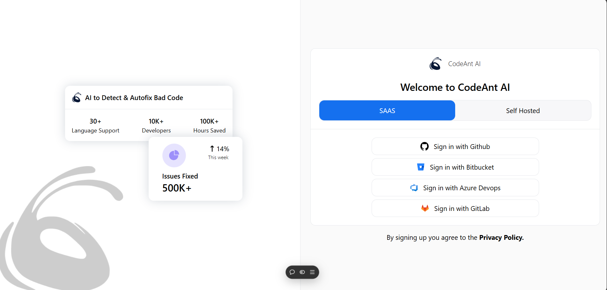
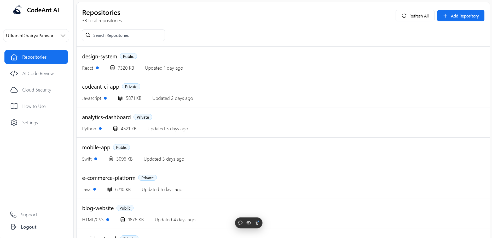

# CodeAnt AI Assignment

## Overview

This project is a frontend implementation based on the provided Figma design for CodeAnt AI
By - Varun Upadhyay (IIIT Una )

### Project Preview




## Features

### Design Implementation

- Pixel-perfect implementation of the provided Figma design
- Responsive layout that works across all device sizes
- Interactive UI elements with appropriate hover states and animations
- Clean and modern user interface

### Technical Features

- Component-based architecture using ReactJS
- Modern HTML5 and CSS3 practices
- Optimized performance and loading times
- Cross-browser compatibility
- Mobile-first responsive design

## Technology Stack

- React
- HTML5
- CSS3
- Tailwind CSS
- Additional libraries as needed

## Installation Guide

1. **Clone the repository:**

   ```bash
   git clone https://github.com/your-username/codeant-assignment.git
   ```

2. **Install dependencies:**

   ```bash
   cd Frontend_Intern_Assignment_CodeAntAI
   npm install
   ```

3. **Run the development server:**

   ```bash
   npm run dev
   ```

4. **Build for production:**
   ```bash
   npm run build
   ```
